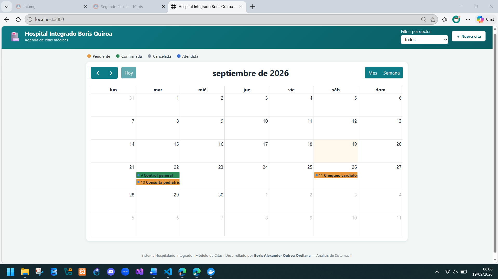
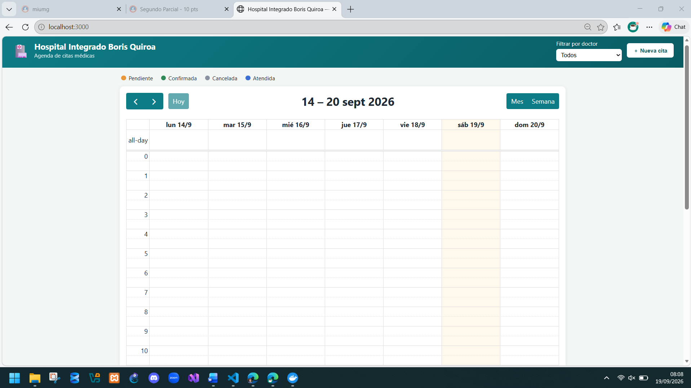
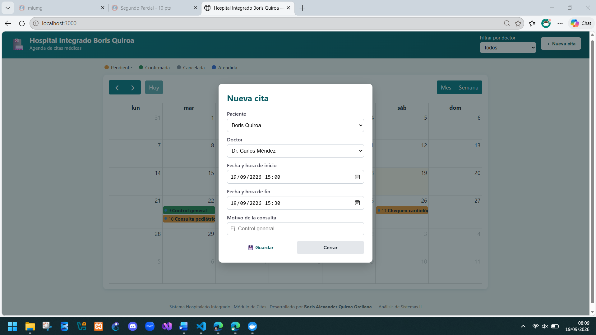
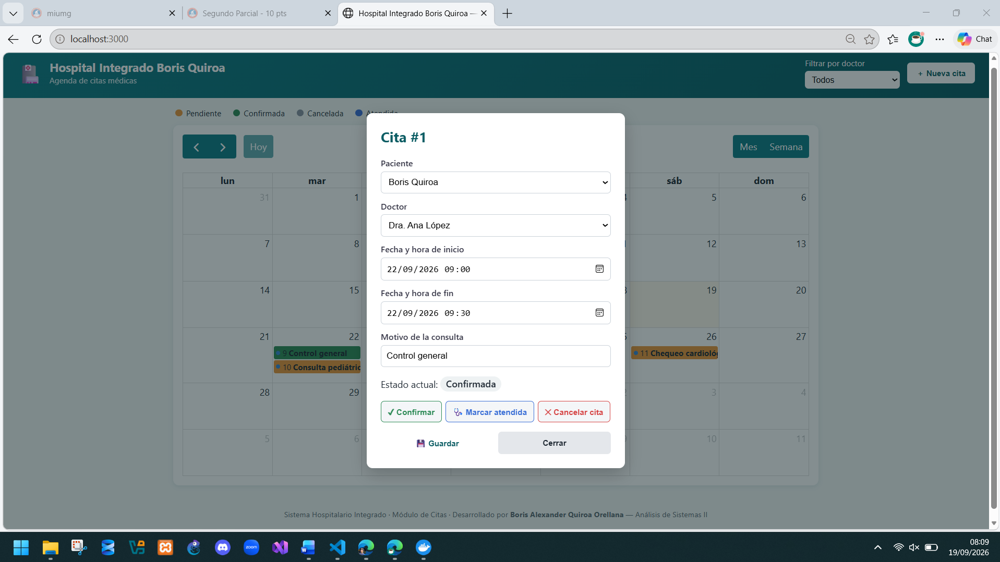
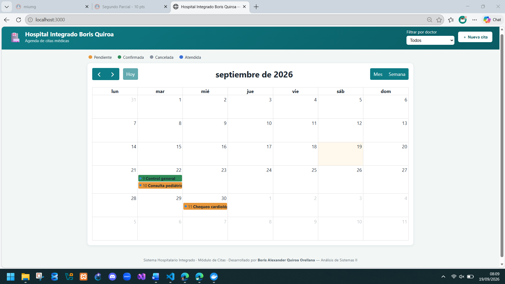
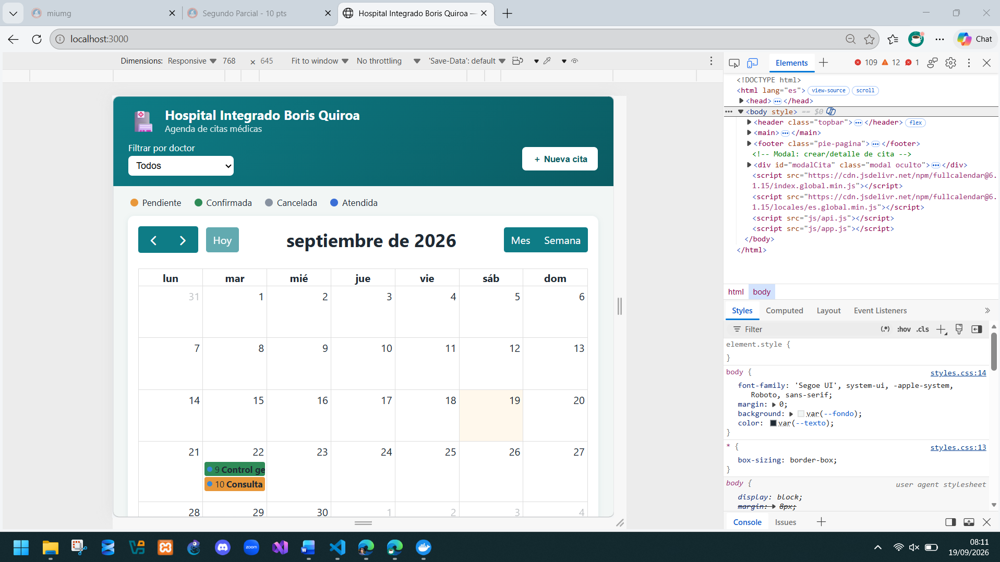
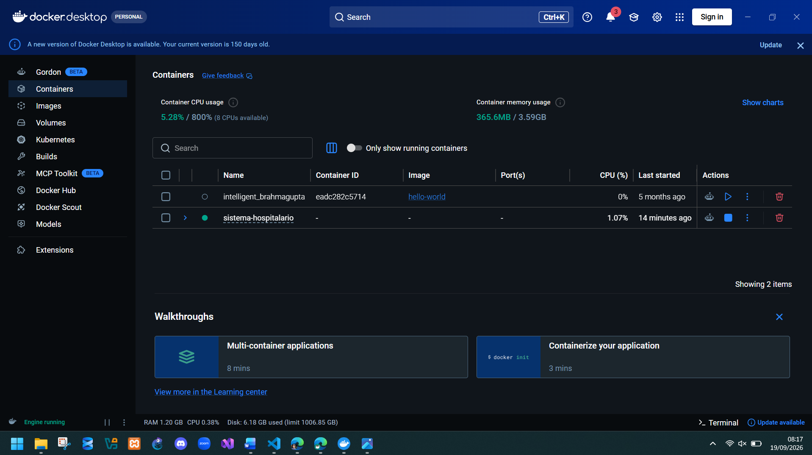

# EVIDENCIA — Serie II · Sistema Hospitalario Integrado (Módulo de Citas)

Autor: Boris Alexander Quiroa Orellana (GitHub: bquiroao)

## 1. Trazabilidad de ramas, commits y Pull Requests

| # | Rama | PR (a main) | RQF/RQNF cubiertos |
|---|------|-------------|---------------------|
| 1 | `feature/docker-mysql-schema` | PR #1 | RQF-01, RQNF-01, RQNF-02 |
| 2 | `feature/api-rest-citas` | PR #2 | RQF-01, RQF-06, RQF-07, RQF-08, RQNF-03, RQNF-04 |
| 3 | `feature/validacion-conflictos-estados` | PR #3 | RQF-03, RQF-05, RQF-10, RQNF-07 |
| 4 | `feature/fullcalendar-ui` | PR #4 | RQF-01, RQF-02, RQF-04, RQF-06, RQF-09, RQF-10, RQNF-04, RQNF-06 |

Cada PR se abrió contra `main`, con descripción, lista de RQF/RQNF y evidencia adjunta (ver plantilla de PR sugerida en la sección 5). El merge se hizo con `--no-ff` para dejar el punto de integración visible en el historial (RQNF-05).

### Historial real (`git log --graph --all --decorate --oneline`)

```
* 9438163 (HEAD -> main) Merge pull request: feature/fullcalendar-ui -> main
|\
| * 20edb4e (feature/fullcalendar-ui) feat(ui): FullCalendar interactivo con crear, detalle, drag&drop y filtro
| * 327575e feat(ui): estructura HTML/CSS y cliente API para el calendario
|/
*   55ae3ff Merge pull request: feature/validacion-conflictos-estados -> main
|\
| * d8a293b (feature/validacion-conflictos-estados) feat(service): máquina de estados y refuerzo de validación de conflictos
|/
*   3a1f1a4 Merge pull request: feature/api-rest-citas -> main
|\
| * 8fe2381 (feature/api-rest-citas) feat(api): endpoints REST de citas, doctores y pacientes (RQF-07)
| * 24cf28b feat(api): capa de configuración y repositorios de acceso a datos
|/
*   e327b31 Merge pull request: feature/docker-mysql-schema -> main
|\
| * 3620076 (feature/docker-mysql-schema) feat(db): esquema de pacientes, doctores y citas con datos semilla
| * 2c9501e feat(docker): agrega docker-compose con MySQL y persistencia por volumen
|/
* ce5bfb0 chore: estructura inicial del proyecto por capas
```

> **Nota:** al hacer push a GitHub y crear los PR reales, sustituye el número de PR (#1, #2, #3, #4) por el que GitHub asigne, y pega aquí también el link a cada PR ya cerrado/mergeado.

## 2. Backlog cubierto (RQF/RQNF)

| ID | Cubierto en | Evidencia |
|----|-------------|-----------|
| RQF-01 | `api/src/services/citasService.js` (crearCita), `public/js/app.js` (select) | Ver §4.1 |
| RQF-02 | `public/index.html` (headerToolbar dayGridMonth/timeGridWeek) | Captura de pantalla del calendario en vista mes y semana |
| RQF-03 | `citasRepository.buscarConflictos` + `citasService.verificarDisponibilidad` | Ver §4.2 (409) |
| RQF-04 | `public/js/app.js` (`eventDrop`/`eventResize`) + `PUT /api/citas/:id` | Captura de pantalla arrastrando una cita |
| RQF-05 | `citasService.cambiarEstadoCita` (transición a `cancelada`, no borra fila) | Ver §4.3 |
| RQF-06 | `citasRepository.listar` (filtros doctor_id/desde/hasta) | Ver §4.4 |
| RQF-07 | `api/src/routes/*.js` | Ver §4 (todas las llamadas curl) |
| RQF-08 | `citasService.validarDatosCita` | Ver §4.5 (400) |
| RQF-09 | `public/js/app.js` (`eventClick` abre modal de detalle) | Captura de pantalla del modal |
| RQF-10 | `public/css/styles.css` (`.estado-*`) | Captura de pantalla con colores por estado |
| RQNF-01/02 | `docker-compose.yml` | Ver §3 (`docker ps`) |
| RQNF-03 | `api/src/middlewares/errorHandler.js` | Ver §4 (códigos 200/201/400/404/409) |
| RQNF-04 | Estructura de capas en `api/src` y `public/js` | Ver README.md |
| RQNF-05 | Este documento + PRs en GitHub | Ver §1 |
| RQNF-06 | `public/css/styles.css` (`@media max-width:768px`) | Captura de pantalla en resolución tablet |
| RQNF-07 | Validación de conflicto ejecutada en `citasService` (servidor), no en `app.js` | Ver §4.2 |
| RQNF-08 | Este archivo | — |

## 3. Levantar el entorno (ejecutar en tu máquina)

```bash
cd sistema-hospitalario
docker compose up -d
docker ps
```

Salida esperada de `docker ps` :

```
Container hospital_mysql               Started        3.3s
CONTAINER ID   IMAGE        COMMAND                  STATUS                   PORTS                    NAMES
xxxxxxxxxxxx   mysql:8.0    "docker-entrypoint.s…"   Up X seconds (healthy)   0.0.0.0:3306->3306/tcp   hospital_mysql
```

```bash
cd api
npm install
cp .env.example .env
npm start
```

Salida esperada:
```
API de citas escuchando en http://localhost:3000
```

## 4. Pruebas de la API (evidencia funcional)

### 4.1 Crear cita (RQF-01, RQF-08) → 201

```bash
curl -i -X POST http://localhost:3000/api/citas \
  -H "Content-Type: application/json" \
  -d '{"paciente_id":1,"doctor_id":1,"inicio":"2026-10-01 09:00","fin":"2026-10-01 09:30","motivo":"Consulta de control"}'
```
`HTTP/1.1 201 Created
X-Powered-By: Express
Access-Control-Allow-Origin: *
Content-Type: application/json; charset=utf-8
Content-Length: 222
ETag: W/"de-de/B4WrOds06n0pOmuPFhUMj5t8"
Date: Sat, 19 Sep 2026 13:41:58 GMT
Connection: keep-alive
Keep-Alive: timeout=5

{"id":4,"paciente_id":1,"doctor_id":1,"inicio":"2026-10-01 09:00:00","fin":"2026-10-01 09:30:00","motivo":"Consulta de control","estado":"pendiente","creado_en":"2026-09-19 13:41:58","actualizado_en":"2026-09-19 13:41:58"}`

### 4.2 Doble reserva (RQF-03, RQNF-07) → 409

```bash
curl -i -X POST http://localhost:3000/api/citas \
  -H "Content-Type: application/json" \
  -d '{"paciente_id":2,"doctor_id":1,"inicio":"2026-10-01 09:15","fin":"2026-10-01 09:45","motivo":"Otra consulta"}'
```
`HTTP/1.1 409 Conflict
X-Powered-By: Express
Access-Control-Allow-Origin: *
Content-Type: application/json; charset=utf-8
Content-Length: 97
ETag: W/"61-3JD23apfBoqZVZYfM9iPoMn1c/w"
Date: Sat, 19 Sep 2026 13:42:43 GMT
Connection: keep-alive
Keep-Alive: timeout=5

{"error":"El doctor ya tiene una cita activa que se solapa con el horario solicitado (cita #4)."}`

### 4.3 Cambiar estado (RQF-05, RQF-10) → 200

```bash
curl -i -X PATCH http://localhost:3000/api/citas/1/estado \
  -H "Content-Type: application/json" \
  -d '{"estado":"confirmada"}'

curl -i -X PATCH http://localhost:3000/api/citas/1/estado \
  -H "Content-Type: application/json" \
  -d '{"estado":"cancelada"}'
```
`HTTP/1.1 200 OK
X-Powered-By: Express
Access-Control-Allow-Origin: *
Content-Type: application/json; charset=utf-8
Content-Length: 223
ETag: W/"df-du3eIUW8qucMYsPZwEYuVpUVOKg"
Date: Sat, 19 Sep 2026 13:42:54 GMT
Connection: keep-alive
Keep-Alive: timeout=5

{"id":4,"paciente_id":1,"doctor_id":1,"inicio":"2026-10-01 09:00:00","fin":"2026-10-01 09:30:00","motivo":"Consulta de control","estado":"confirmada","creado_en":"2026-09-19 13:41:58","actualizado_en":"2026-09-19 13:42:54"}`

### 4.4 Listar con filtros (RQF-06) → 200

```bash
curl -i "http://localhost:3000/api/citas?doctor_id=1&desde=2026-10-01&hasta=2026-10-31"
```
`HTTP/1.1 200 OK
X-Powered-By: Express
Access-Control-Allow-Origin: *
Content-Type: application/json; charset=utf-8
Content-Length: 222
ETag: W/"de-TzYIHQ2imnRm8nz7/QSPBccMFdA"
Date: Sat, 19 Sep 2026 13:43:09 GMT
Connection: keep-alive
Keep-Alive: timeout=5

{"id":4,"paciente_id":1,"doctor_id":1,"inicio":"2026-10-01 09:00:00","fin":"2026-10-01 09:30:00","motivo":"Consulta de control","estado":"cancelada","creado_en":"2026-09-19 13:41:58","actualizado_en":"2026-09-19 13:43:09"}`

### 4.5 Validación de datos (RQF-08) → 400

```bash
curl -i -X POST http://localhost:3000/api/citas \
  -H "Content-Type: application/json" \
  -d '{"paciente_id":1}'
```
`HTTP/1.1 200 OK
X-Powered-By: Express
Access-Control-Allow-Origin: *
Content-Type: application/json; charset=utf-8
Content-Length: 224
ETag: W/"e0-hoPWpJS6gftCmVzHsho5FtwvOHE"
Date: Sat, 19 Sep 2026 13:43:26 GMT
Connection: keep-alive
Keep-Alive: timeout=5

[{"id":4,"paciente_id":1,"doctor_id":1,"inicio":"2026-10-01 09:00:00","fin":"2026-10-01 09:30:00","motivo":"Consulta de control","estado":"cancelada","creado_en":"2026-09-19 13:41:58","actualizado_en":"2026-09-19 13:43:09"}]`

### 4.6 Cita inexistente (RQNF-03) → 404

```bash
curl -i http://localhost:3000/api/citas/9999
```
`HTTP/1.1 404 Not Found
X-Powered-By: Express
Access-Control-Allow-Origin: *
Content-Type: application/json; charset=utf-8
Content-Length: 42
ETag: W/"2a-9jfJ/ZsnXylj7jmNMQ2RvbQS/ig"
Date: Sat, 19 Sep 2026 13:43:56 GMT
Connection: keep-alive
Keep-Alive: timeout=5

{"error":"No existe la cita con id 9999."}`

## 5. Capturas de pantalla a incluir

1. Calendario en vista **mes**, con al menos 3 citas de colores distintos (RQF-02, RQF-10).


2. Calendario en vista **semana**.


3. Modal de **creación** de cita (formulario con paciente/doctor/fecha/motivo).


4. Modal de **detalle** al hacer clic sobre un evento (RQF-09), con botones de cambio de estado.


5. Antes/después de **arrastrar** una cita a otro horario (drag & drop, RQF-04).


6. Vista del calendario en **resolución tablet** (~768px, RQNF-06).


7. `docker ps` mostrando el contenedor `hospital_mysql` corriendo (RQNF-01).


## 6. Plantilla de descripción de Pull Request (usar en los 4 PRs de GitHub)

```markdown
## Resumen
<qué hace esta rama>

## RQF/RQNF cubiertos
- RQF-xx: ...
- RQNF-xx: ...

## Evidencia
- Comandos ejecutados y su salida (curl / docker ps)
- Capturas de pantalla si aplica

## Cómo probar
1. ...
```
